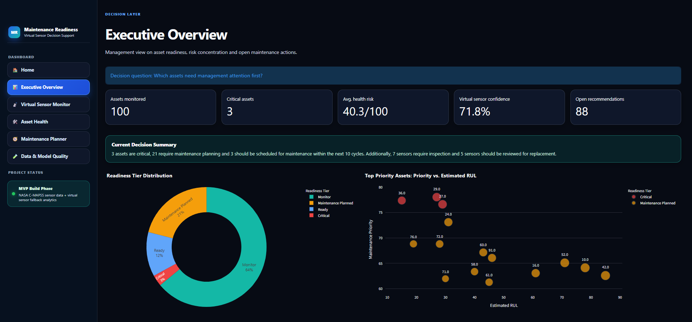
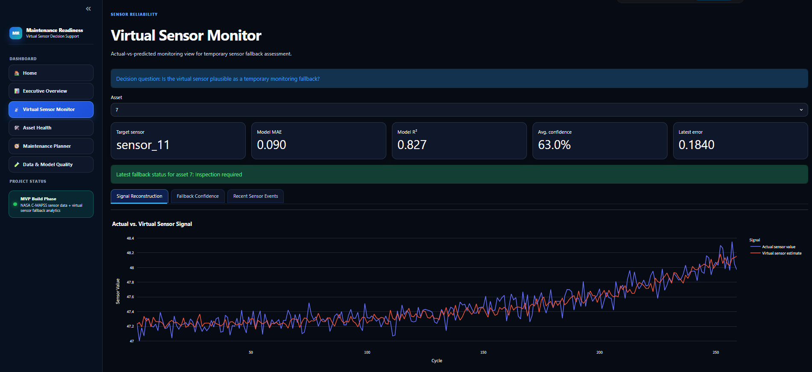
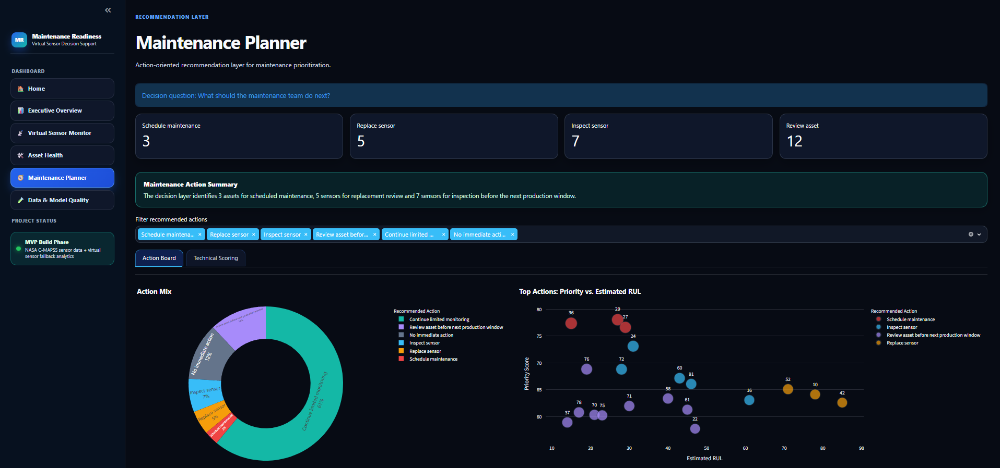

# Maintenance Readiness & Virtual Sensor Decision Support

## One-Sentence Pitch

A Streamlit-based industrial analytics MVP that uses virtual sensor prediction, asset health scoring and recommendation logic to support maintenance readiness decisions.

---

## Business Problem

Industrial maintenance teams often need to assess asset readiness under imperfect sensor conditions. Sensors can drift, fail or produce unreliable values, which makes it harder to decide which machines require attention first.

This project builds a decision-support layer for that situation. It does not automate machine control. Instead, it translates industrial sensor time series into:

* virtual sensor fallback estimates
* fallback confidence signals
* asset health scores
* readiness tiers
* prioritized maintenance recommendations

The goal is to support maintenance planners, reliability engineers and operations teams with a structured view on asset risk, sensor reliability and next-best actions.

---

## Target Users

* Maintenance planners
* Reliability engineers
* Industrial analytics teams
* Production and operations managers
* Digital transformation teams
* AI adoption teams in industrial environments

---

## Safety Boundary

The virtual sensor is implemented as a monitoring and decision-support fallback.

It is not:

* a certified replacement for physical instrumentation
* a safety-critical sensor replacement
* an automated machine-control system
* an autonomous maintenance scheduling system

The project is designed as an analytics MVP for portfolio, learning and decision-support demonstration purposes.

---

## Data Source

The MVP uses the NASA C-MAPSS FD001 turbofan degradation dataset.

Expected raw files in `data/raw/`:

```text
train_FD001.txt
test_FD001.txt
RUL_FD001.txt
```

For the current MVP pipeline, only `train_FD001.txt` is required. The training trajectories are run-to-failure histories and are used to calculate Remaining Useful Life labels.

---

## Architecture

```text
Raw NASA C-MAPSS FD001 data
        ↓
Data preparation and RUL calculation
        ↓
Sensor profile generation
        ↓
Virtual sensor model training
        ↓
Actual-vs-predicted sensor validation
        ↓
Fallback confidence scoring
        ↓
Asset health scoring
        ↓
Maintenance recommendation layer
        ↓
Streamlit decision-support dashboard
        ↓
Validation and output-contract tests
```

---

## Core Modules

| Module               | Main Output                                                      |
| -------------------- | ---------------------------------------------------------------- |
| Data preparation     | `sensor_readings.parquet`                                        |
| Sensor profiling     | `sensor_profile.parquet`                                         |
| Virtual sensor model | `virtual_sensor_predictions.parquet`, `virtual_sensor_model.pkl` |
| Asset health scoring | `asset_health.parquet`                                           |
| Recommendation layer | `maintenance_recommendations.parquet`                            |
| Dashboard            | Streamlit app                                                    |
| Output validation    | `06_validate_project_outputs.py`                                 |
| Tests                | `test_project_output_contract.py`                                |

### Module Responsibilities

**Data preparation**
Loads NASA C-MAPSS data, assigns readable column names and calculates Remaining Useful Life labels.

**Sensor profiling**
Analyzes missingness, signal variation, uniqueness and RUL correlation to identify suitable sensor candidates for virtual sensor modeling.

**Virtual sensor model**
Reconstructs a selected target sensor from the remaining sensor and operating signals using a machine learning model.

**Fallback confidence scoring**
Compares actual and predicted sensor values and translates prediction quality into confidence categories.

**Asset health scoring**
Combines RUL risk, sensor deviation, virtual sensor confidence risk and trend risk into an asset-level health score.

**Recommendation layer**
Converts risk signals into operational maintenance actions such as inspection, maintenance scheduling or limited monitoring.

**Dashboard**
Presents the decision layer through business-facing and technical validation views.

**Output validation**
Checks generated files, schemas, score ranges, prediction records, recommendations and dashboard input data.

**Tests**
Validates the output contract of the pipeline and ensures that generated artefacts remain structurally valid.

---

## Scoring Logic

High scores indicate higher risk or higher maintenance urgency.

### Asset Health Score

```text
Asset Health Score =
0.45 * RUL Risk Score
+ 0.25 * Sensor Deviation Score
+ 0.20 * Virtual Sensor Confidence Risk
+ 0.10 * Trend Risk
```

### Maintenance Priority

```text
Maintenance Priority =
0.50 * Asset Health Score
+ 0.30 * Sensor Deviation Score
+ 0.20 * RUL Risk Score
```

---

## Dashboard Pages

The dashboard is structured around decision questions. Each page supports a specific maintenance, reliability or quality-assurance decision.

### Executive Overview

**Decision question:** Which assets need management attention first?

**Purpose:**
Provides a management-level summary of asset readiness, risk concentration and open maintenance recommendations.

### Virtual Sensor Monitor

**Decision question:** Is the virtual sensor plausible as a temporary monitoring fallback?

**Purpose:**
Compares actual and predicted sensor values, separates fallback confidence from prediction error and shows recent validation events for a selected asset.

### Asset Health

**Decision question:** Which machines are most exposed from a readiness perspective?

**Purpose:**
Shows asset-level health scoring, estimated RUL, deviation exposure and readiness tiers.

### Maintenance Planner

**Decision question:** What should the maintenance team do next?

**Purpose:**
Turns health and sensor-risk signals into prioritized maintenance actions.

### Data & Model Quality

**Decision question:** Is the selected sensor technically defensible for the MVP?

**Purpose:**
Shows quality gates, baseline-vs-model benchmark results, sensor evidence and validation records.

---

## Dashboard Screenshots

### Executive Overview



The executive overview summarizes asset readiness, critical assets and open maintenance actions for management-level prioritization.

### Virtual Sensor Monitor



The virtual sensor monitor compares actual and reconstructed sensor values and separates fallback confidence from prediction error.

### Maintenance Planner



The maintenance planner translates risk signals into prioritized next-best actions for maintenance planning.

Additional recommended screenshots:

```text
outputs/screenshots/01_home.png
outputs/screenshots/04_asset_health.png
outputs/screenshots/06_data_model_quality.png
```

---

## Example Results

Current validated MVP output:

| Metric                            |    Value |
| --------------------------------- | -------: |
| Sensor reading records            |   20,631 |
| Sensor profile records            |       21 |
| Virtual sensor prediction records |   20,631 |
| Validation prediction records     |    4,104 |
| Asset health records              |      100 |
| Maintenance recommendations       |      100 |
| Actionable recommendations        |       88 |
| Critical assets                   |        3 |
| Maintenance planned assets        |       21 |
| Model MAE                         |    0.090 |
| Model R²                          |    0.827 |
| Output validation warnings        |        0 |
| Output validation errors          |        0 |
| Pytest result                     | 6 passed |

---

## Readiness Distribution

| Readiness Tier      | Assets |
| ------------------- | -----: |
| Monitor             |     64 |
| Maintenance Planned |     21 |
| Ready               |     12 |
| Critical            |      3 |

---

## Fallback Status Distribution

| Fallback Status          | Records |
| ------------------------ | ------: |
| Reliable fallback        |  10,378 |
| Limited fallback         |   6,563 |
| Inspection required      |   3,054 |
| Fallback not recommended |     636 |

---

## Recommendation Logic

The recommendation layer translates analytical scores into maintenance actions.

| Recommendation                             | Meaning                                                  |
| ------------------------------------------ | -------------------------------------------------------- |
| Schedule maintenance                       | High-priority asset requiring planned intervention       |
| Replace sensor                             | Sensor behavior indicates replacement review             |
| Inspect sensor                             | Sensor requires inspection before continued reliance     |
| Review asset before next production window | Asset should be reviewed before operational continuation |
| Continue limited monitoring                | Monitoring can continue, but with caution                |
| No immediate action                        | No urgent action required                                |

---

## Tech Stack

| Area             | Technology            |
| ---------------- | --------------------- |
| Language         | Python                |
| Data processing  | Pandas, NumPy         |
| Machine learning | Scikit-learn          |
| Model type       | RandomForestRegressor |
| Dashboard        | Streamlit             |
| Visualization    | Plotly                |
| Storage format   | Parquet via PyArrow   |
| Testing          | Pytest                |

---

## Project Structure

```text
maintenance-readiness-virtual-sensor/
├── app/
│   └── streamlit_app.py
├── data/
│   ├── raw/
│   └── processed/
├── models/
├── outputs/
│   └── screenshots/
├── scripts/
│   ├── 00_project_status.py
│   ├── 01_prepare_data.py
│   ├── 02_train_virtual_sensor.py
│   ├── 03_calculate_asset_health.py
│   ├── 04_generate_recommendations.py
│   ├── 05_run_pipeline.py
│   └── 06_validate_project_outputs.py
├── src/
│   ├── views/
│   │   ├── asset_health_view.py
│   │   ├── data_model_quality_view.py
│   │   ├── executive_overview_view.py
│   │   ├── home_view.py
│   │   ├── maintenance_planner_view.py
│   │   └── virtual_sensor_monitor_view.py
│   ├── asset_health.py
│   ├── config.py
│   ├── data_prep.py
│   ├── recommendations.py
│   ├── ui_style.py
│   └── virtual_sensor.py
├── tests/
│   ├── conftest.py
│   └── test_project_output_contract.py
├── README.md
├── requirements.txt
└── .gitignore
```

---

## Installation

```powershell
python -m venv .venv
.\.venv\Scripts\activate
python -m pip install --upgrade pip
pip install -r requirements.txt
```

---

## How to Run

### 1. Add raw data

Place the raw NASA C-MAPSS FD001 file in:

```text
data/raw/train_FD001.txt
```

### 2. Run the full pipeline

```powershell
python scripts/05_run_pipeline.py
```

### 3. Check project status

```powershell
python scripts/00_project_status.py
```

### 4. Validate generated outputs

```powershell
python scripts/06_validate_project_outputs.py
```

Expected result:

```text
Status: PASSED
Warnings: 0
Errors: 0
```

### 5. Run tests

```powershell
pytest
```

Expected result:

```text
6 passed
```

### 6. Start the dashboard

```powershell
streamlit run app/streamlit_app.py
```

---

## Quality Checks

The project includes explicit validation and testing steps.

### Compile Check

```powershell
python -m compileall src scripts app
```

### Pipeline Output Validation

```powershell
python scripts/06_validate_project_outputs.py
```

The validation script checks:

* expected output files exist
* Parquet and JSON outputs are readable
* generated datasets are not empty
* required columns are present
* score columns stay within 0–100
* prediction records exist
* recommendations exist
* dashboard core inputs are available
* model metrics are available and valid

### Test Suite

```powershell
pytest
```

The test suite validates:

* expected artefacts exist
* core outputs are not empty
* prediction schema is valid
* asset health schema is valid
* recommendation schema is valid
* model quality improves over baseline

---

## MVP Definition of Done

The MVP is considered complete when:

* the pipeline runs from raw data to recommendations
* at least one target sensor is reconstructed virtually
* actual vs. predicted sensor behavior is visible in the dashboard
* fallback confidence is calculated and displayed
* asset health scores are generated
* readiness tiers are generated
* maintenance recommendations are generated
* dashboard pages answer clear operational decision questions
* output validation passes without warnings or errors
* tests pass successfully
* README explains the business problem, safety boundary and technical approach clearly

---

## Limitations

* The MVP uses NASA C-MAPSS simulation data, not live production data.
* The virtual sensor is not certified for safety-critical operation.
* The system does not perform automated machine control.
* The asset snapshot is created from historical run-to-failure trajectories to create a portfolio-style monitoring view.
* RUL labels are used for scoring and validation, but RUL prediction itself is not the primary ML objective of this MVP.
* The recommendation logic is rule-based and designed for explainable decision support, not autonomous scheduling.
* The dashboard is optimized for portfolio demonstration and analytical storytelling, not enterprise deployment.

---

## Security and Data Handling

* No API keys or secrets are required.
* Raw and processed data are separated.
* The dashboard uses local processed files.
* No personal or sensitive production data is used.
* The safety boundary is explicitly documented.
* The project avoids automated control decisions and frames all outputs as decision support.

---

## Roadmap

Potential future extensions:

* Add comparison between multiple virtual sensor model types
* Add feature importance explanation for the selected target sensor
* Add model drift monitoring over simulated operating windows
* Add exportable maintenance action list
* Add scenario view for different maintenance planning thresholds
* Add a lightweight SQLite or DuckDB layer for reproducible local querying

---

## Interview Pitch

I built an industrial analytics MVP that uses NASA C-MAPSS sensor time series to assess machine health, sensor reliability and maintenance priority.

The core idea is a virtual sensor fallback: one selected sensor is reconstructed from the remaining operating and sensor signals. The project compares actual and predicted values, calculates fallback confidence, converts risk signals into asset health scores and generates prioritized maintenance recommendations.

The important point is that this is not a machine-control system. It is a decision-support layer for maintenance planning. The dashboard helps users understand which assets are critical, whether virtual monitoring is plausible and what the next maintenance action should be.

I also added output validation and pytest-based contract tests to make sure the pipeline remains reproducible and technically defensible.
